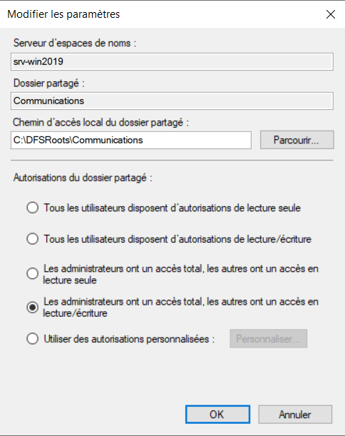

**Rôle DFS/DFS-R**

Nous allons mettre en application le DFS et le DFSR, le premier permet
aux utilisateurs l'accès aux données distribuées, le second assurera la
réplication entre les cibles.

Pour se faire, nous avons besoin de 2 serveurs :

On clone le 1^e^ serveur, on se rend dans le serveur cloné, on sysprep
la machine en mode OOBE et on la redémarre pour la rendre distincte du
1^e^ serveur

On modifie le nom de la machine et son adresse ip

On installe le service ADDS sur le 1^e^ serveur rattaché au nom de
domaine CONTOSO

On rafraichit dans l'adds

Notre serveur s'est bien ajouté à l'Active Directory

On se rend dans le gestionnaire de rôles et fonctionnalités et on y
ajoute l'espace de noms DFS ainsi que la réplication DFS

Sur le serveur principal qui est pour moi SRV-WIN2019, je vais
lancer l'application « Gestion du système de fichiers distribués DFS »

Faites clic droit sur « Espace de noms » puis cliquez sur « Nouvel
espace de noms... ».

Entrez le nom du serveur qui hébergera l'espace de nom

Puis cliquez sur « Modifier les paramètres ... »

Choisissez les paramètres qui vous conviennent. Pour ma part j'ai choisi
de laisser l'accès en lecture et écriture aux utilisateurs et un accès
total aux administrateurs.

Pour le type d'espace de nom à créer, on laisse les valeurs par défaut :

Maintenant que l'espace de noms est opérationnel, nous devons ajouter
les dossiers de notre partage.

Clic droit sur notre espace de noms et Nouveau dossier...

Clic droit sur réplication → Nouveau groupe de réplication

On choisit le groupe de réplication multi-usage

On lui définit un nom et son domaine :

On y ajoute les membres (serveurs) désirés en cliquant sur ajouter et en
spécifiant le nom exact de nos membres

Comme sélection de topologie, on définit maille pleine :

On définit la planification de la bande passante :

En tant que membre principal, on choisit le serveur de son choix qui
fera office de membre principal

On ajoute un chemin d'accès local :

On définit un chemin d'accès local de C:\\ pour les autres membres

On confirme et on crée la réplication

Quelques secondes après tous les dossiers du partage commun dans
SRV-WIN2019 sont répliqués dans le dossier commun du serveur SRV-20192.

